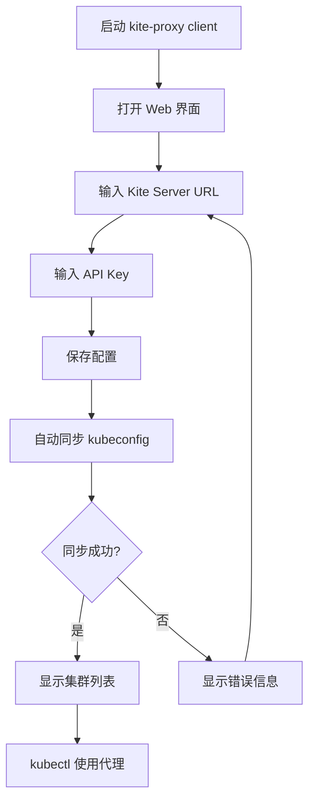

# Kite-Proxy 客户端开发规范

## 📋 项目概述

Kite-Proxy 客户端是一个独立的代理应用程序，允许用户通过 API Key 从 Kite 服务端获取 Kubernetes 集群的 kubeconfig，并在本地提供 Kubernetes API 代理服务。

### 核心特性

- ✅ 使用 API Key 认证，无需浏览器登录
- ✅ 从服务端动态获取 kubeconfig，无需手动配置
- ✅ Kubeconfig 仅保存在内存中，不写入磁盘
- ✅ 多个 kubectl 连接共享同一个内存中的 kubeconfig
- ✅ 提供简单的 Web 界面管理连接

---

## 🏗️ 技术架构

### 推荐技术栈

#### 后端
- **语言**: Go 1.21+
- **Web 框架**: Gin 或 Fiber
- **Kubernetes 客户端**: client-go
- **配置解析**: k8s.io/client-go/tools/clientcmd

#### 前端
- **框架**: React + TypeScript + Vite（与 Kite 主项目保持一致）
- **UI 库**: Tailwind CSS + shadcn/ui
- **状态管理**: React Context 或 Zustand
- **HTTP 客户端**: fetch API

### 架构图

```
┌─────────────────────────────────────────────────────────────┐
│                    Kite-Proxy Client                         │
│                                                               │
│  ┌─────────────┐      ┌──────────────────┐                  │
│  │  Web UI     │      │  Configuration    │                  │
│  │  (React)    │◄────►│  Manager          │                  │
│  └─────────────┘      └──────────────────┘                  │
│         │                      │                              │
│         │                      ▼                              │
│         │              ┌──────────────────┐                  │
│         └─────────────►│  HTTP Server     │                  │
│                        │  (API Endpoints) │                  │
│                        └──────────────────┘                  │
│                                │                              │
│                                ▼                              │
│                        ┌──────────────────┐                  │
│                        │  Kite API Client │                  │
│                        │  (Fetch Config)  │                  │
│                        └──────────────────┘                  │
│                                │                              │
│                                ▼                              │
│                        ┌──────────────────┐                  │
│                        │ Kubeconfig Store │                  │
│                        │  (Memory Only)   │                  │
│                        └──────────────────┘                  │
│                                │                              │
│                                ▼                              │
│                        ┌──────────────────┐                  │
│                        │ K8s API Proxy    │                  │
│                        │  (Reverse Proxy) │                  │
│                        └──────────────────┘                  │
└─────────────────────────────────────────────────────────────┘
                                 │
                                 ▼
                    ┌─────────────────────────┐
                    │   kubectl / K8s Tools   │
                    └─────────────────────────┘
```

---

## 🔌 API 集成

### 1. Kite 服务端 API

#### 获取 Kubeconfig

**接口地址**: `GET /api/v1/proxy/kubeconfig`

**请求头**:
```http
Authorization: Bearer kite<id>-<random>
```

**查询参数**:
- `cluster` (可选): 只获取指定集群的配置

**响应示例**:

```json
{
  "clusters": [
    {
      "name": "production",
      "kubeconfig": "apiVersion: v1\nkind: Config\nclusters:\n- cluster:\n    certificate-authority-data: LS0t...\n    server: https://k8s-api.example.com:6443\n  name: production\n..."
    },
    {
      "name": "staging",
      "kubeconfig": "apiVersion: v1\nkind: Config\n..."
    }
  ]
}
```

**错误响应**:

```json
{
  "error": "Invalid or expired token"
}
```

```json
{
  "error": "no clusters available for proxy or proxy not permitted"
}
```

#### 使用示例

```go
func fetchKubeconfigs(apiEndpoint, apiKey string) ([]ClusterConfig, error) {
    url := fmt.Sprintf("%s/api/v1/proxy/kubeconfig", apiEndpoint)
    
    req, err := http.NewRequest("GET", url, nil)
    if err != nil {
        return nil, err
    }
    
    req.Header.Set("Authorization", "Bearer " + apiKey)
    
    client := &http.Client{Timeout: 10 * time.Second}
    resp, err := client.Do(req)
    if err != nil {
        return nil, err
    }
    defer resp.Body.Close()
    
    if resp.StatusCode != http.StatusOK {
        body, _ := io.ReadAll(resp.Body)
        return nil, fmt.Errorf("API error: %s", string(body))
    }
    
    var result struct {
        Clusters []struct {
            Name       string `json:"name"`
            Kubeconfig string `json:"kubeconfig"`
        } `json:"clusters"`
    }
    
    if err := json.NewDecoder(resp.Body).Decode(&result); err != nil {
        return nil, err
    }
    
    configs := make([]ClusterConfig, len(result.Clusters))
    for i, c := range result.Clusters {
        configs[i] = ClusterConfig{
            Name:       c.Name,
            Kubeconfig: c.Kubeconfig,
        }
    }
    
    return configs, nil
}
```

---

## 💾 核心功能实现

### 1. 内存中的 Kubeconfig 管理

**要求**:
- Kubeconfig 不能写入磁盘文件
- 需要支持多集群配置
- 配置需要能够动态刷新

**实现方案**:

```go
package proxy

import (
    "sync"
    "k8s.io/client-go/tools/clientcmd"
    "k8s.io/client-go/tools/clientcmd/api"
)

// KubeconfigStore 在内存中存储 kubeconfig
type KubeconfigStore struct {
    mu      sync.RWMutex
    configs map[string]*api.Config // cluster name -> Config
}

func NewKubeconfigStore() *KubeconfigStore {
    return &KubeconfigStore{
        configs: make(map[string]*api.Config),
    }
}

// LoadFromYAML 从 YAML 字符串加载配置到内存
func (s *KubeconfigStore) LoadFromYAML(clusterName string, kubeconfigYAML string) error {
    s.mu.Lock()
    defer s.mu.Unlock()
    
    config, err := clientcmd.Load([]byte(kubeconfigYAML))
    if err != nil {
        return fmt.Errorf("failed to parse kubeconfig: %w", err)
    }
    
    s.configs[clusterName] = config
    return nil
}

// Get 获取指定集群的配置
func (s *KubeconfigStore) Get(clusterName string) (*api.Config, error) {
    s.mu.RLock()
    defer s.mu.RUnlock()
    
    config, ok := s.configs[clusterName]
    if !ok {
        return nil, fmt.Errorf("cluster %s not found", clusterName)
    }
    
    return config, nil
}

// List 列出所有集群名称
func (s *KubeconfigStore) List() []string {
    s.mu.RLock()
    defer s.mu.RUnlock()
    
    names := make([]string, 0, len(s.configs))
    for name := range s.configs {
        names = append(names, name)
    }
    return names
}

// Clear 清空所有配置
func (s *KubeconfigStore) Clear() {
    s.mu.Lock()
    defer s.mu.Unlock()
    
    s.configs = make(map[string]*api.Config)
}
```

### 2. Kubernetes API 反向代理

**要求**:
- 将本地 kubectl 请求转发到真实的 K8s API Server
- 使用内存中的 kubeconfig 进行认证
- 支持多集群切换

**实现方案**:

```go
package proxy

import (
    "crypto/tls"
    "crypto/x509"
    "encoding/base64"
    "fmt"
    "net/http"
    "net/http/httputil"
    "net/url"
)

// K8sProxy 代理 Kubernetes API 请求
type K8sProxy struct {
    store *KubeconfigStore
}

func NewK8sProxy(store *KubeconfigStore) *K8sProxy {
    return &K8sProxy{store: store}
}

// Handler 处理代理请求
func (p *K8sProxy) Handler(clusterName string) http.HandlerFunc {
    return func(w http.ResponseWriter, r *http.Request) {
        config, err := p.store.Get(clusterName)
        if err != nil {
            http.Error(w, err.Error(), http.StatusNotFound)
            return
        }
        
        // 获取集群配置
        cluster := config.Clusters[clusterName]
        if cluster == nil {
            http.Error(w, "cluster config not found", http.StatusInternalServerError)
            return
        }
        
        // 解析目标 URL
        targetURL, err := url.Parse(cluster.Server)
        if err != nil {
            http.Error(w, "invalid server URL", http.StatusInternalServerError)
            return
        }
        
        // 配置 TLS
        tlsConfig := &tls.Config{}
        if len(cluster.CertificateAuthorityData) > 0 {
            caCertPool := x509.NewCertPool()
            caCertPool.AppendCertsFromPEM(cluster.CertificateAuthorityData)
            tlsConfig.RootCAs = caCertPool
        }
        if cluster.InsecureSkipTLSVerify {
            tlsConfig.InsecureSkipVerify = true
        }
        
        // 创建反向代理
        proxy := httputil.NewSingleHostReverseProxy(targetURL)
        proxy.Transport = &http.Transport{
            TLSClientConfig: tlsConfig,
        }
        
        // 添加认证信息
        if authInfo := config.AuthInfos[config.CurrentContext]; authInfo != nil {
            if authInfo.Token != "" {
                r.Header.Set("Authorization", "Bearer "+authInfo.Token)
            } else if authInfo.ClientCertificateData != nil && authInfo.ClientKeyData != nil {
                // 客户端证书认证
                cert, err := tls.X509KeyPair(authInfo.ClientCertificateData, authInfo.ClientKeyData)
                if err == nil {
                    tlsConfig.Certificates = []tls.Certificate{cert}
                }
            }
        }
        
        // 执行代理
        proxy.ServeHTTP(w, r)
    }
}
```

### 3. 配置同步与刷新

**要求**:
- 定期从 Kite 服务端同步配置
- 检测配置变更并自动更新
- 提供手动刷新功能

**实现方案**:

```go
package proxy

import (
    "context"
    "log"
    "time"
)

// ConfigSyncer 负责同步配置
type ConfigSyncer struct {
    apiEndpoint string
    apiKey      string
    store       *KubeconfigStore
    client      *KiteAPIClient
    interval    time.Duration
}

func NewConfigSyncer(apiEndpoint, apiKey string, store *KubeconfigStore) *ConfigSyncer {
    return &ConfigSyncer{
        apiEndpoint: apiEndpoint,
        apiKey:      apiKey,
        store:       store,
        client:      NewKiteAPIClient(apiEndpoint, apiKey),
        interval:    5 * time.Minute, // 默认每 5 分钟同步一次
    }
}

// Start 启动自动同步
func (s *ConfigSyncer) Start(ctx context.Context) {
    // 立即同步一次
    if err := s.Sync(); err != nil {
        log.Printf("Initial sync failed: %v", err)
    }
    
    ticker := time.NewTicker(s.interval)
    defer ticker.Stop()
    
    for {
        select {
        case <-ctx.Done():
            return
        case <-ticker.C:
            if err := s.Sync(); err != nil {
                log.Printf("Config sync failed: %v", err)
            } else {
                log.Println("Config synced successfully")
            }
        }
    }
}

// Sync 执行一次配置同步
func (s *ConfigSyncer) Sync() error {
    configs, err := s.client.FetchKubeconfigs()
    if err != nil {
        return err
    }
    
    // 清空旧配置
    s.store.Clear()
    
    // 加载新配置
    for _, cfg := range configs {
        if err := s.store.LoadFromYAML(cfg.Name, cfg.Kubeconfig); err != nil {
            log.Printf("Failed to load config for cluster %s: %v", cfg.Name, err)
            continue
        }
    }
    
    return nil
}
```

---

## 🌐 Web 界面设计

### 页面结构

```
kite-proxy-client/
├── ui/
│   ├── src/
│   │   ├── pages/
│   │   │   ├── Dashboard.tsx          # 主面板
│   │   │   ├── Settings.tsx           # 设置页面
│   │   │   └── ClusterList.tsx        # 集群列表
│   │   ├── components/
│   │   │   ├── ClusterCard.tsx        # 集群卡片
│   │   │   ├── ConnectionStatus.tsx   # 连接状态
│   │   │   └── ApiKeyInput.tsx        # API Key 输入
│   │   ├── hooks/
│   │   │   └── useConfig.ts           # 配置管理 Hook
│   │   └── App.tsx
│   └── package.json
```

### 主要功能页面

#### 1. Dashboard（主面板）

**显示内容**:
- 连接状态（已连接/未连接）
- 当前可用集群列表
- 快速操作按钮（刷新配置、复制 kubeconfig）

**示例代码**:

```tsx
import React, { useEffect, useState } from 'react';
import { Card, CardContent, CardHeader, CardTitle } from '@/components/ui/card';
import { Button } from '@/components/ui/button';
import { Badge } from '@/components/ui/badge';

interface Cluster {
  name: string;
  server: string;
  status: 'connected' | 'disconnected';
}

export default function Dashboard() {
  const [clusters, setClusters] = useState<Cluster[]>([]);
  const [loading, setLoading] = useState(false);

  const fetchClusters = async () => {
    setLoading(true);
    try {
      const response = await fetch('/api/clusters');
      const data = await response.json();
      setClusters(data.clusters);
    } catch (error) {
      console.error('Failed to fetch clusters:', error);
    } finally {
      setLoading(false);
    }
  };

  const refreshConfig = async () => {
    try {
      await fetch('/api/sync', { method: 'POST' });
      await fetchClusters();
    } catch (error) {
      console.error('Failed to refresh config:', error);
    }
  };

  useEffect(() => {
    fetchClusters();
    const interval = setInterval(fetchClusters, 30000); // 每 30 秒刷新状态
    return () => clearInterval(interval);
  }, []);

  return (
    <div className="container mx-auto p-6">
      <div className="flex justify-between items-center mb-6">
        <h1 className="text-3xl font-bold">Kite-Proxy Client</h1>
        <Button onClick={refreshConfig} disabled={loading}>
          {loading ? 'Refreshing...' : 'Refresh Config'}
        </Button>
      </div>

      <div className="grid grid-cols-1 md:grid-cols-2 lg:grid-cols-3 gap-4">
        {clusters.map((cluster) => (
          <Card key={cluster.name}>
            <CardHeader>
              <CardTitle className="flex justify-between items-center">
                {cluster.name}
                <Badge variant={cluster.status === 'connected' ? 'default' : 'secondary'}>
                  {cluster.status}
                </Badge>
              </CardTitle>
            </CardHeader>
            <CardContent>
              <p className="text-sm text-muted-foreground">{cluster.server}</p>
              <div className="mt-4 space-x-2">
                <Button variant="outline" size="sm">Test Connection</Button>
                <Button variant="outline" size="sm">View Details</Button>
              </div>
            </CardContent>
          </Card>
        ))}
      </div>

      {clusters.length === 0 && !loading && (
        <div className="text-center py-12">
          <p className="text-muted-foreground">No clusters configured</p>
          <p className="text-sm text-muted-foreground mt-2">
            Please configure your API key in Settings
          </p>
        </div>
      )}
    </div>
  );
}
```

#### 2. Settings（设置页面）

**配置项**:
- Kite 服务端地址
- API Key 输入
- 自动同步间隔
- 本地代理端口

```tsx
import React, { useState } from 'react';
import { Card, CardContent, CardHeader, CardTitle } from '@/components/ui/card';
import { Input } from '@/components/ui/input';
import { Label } from '@/components/ui/label';
import { Button } from '@/components/ui/button';

export default function Settings() {
  const [config, setConfig] = useState({
    serverUrl: 'http://localhost:18088',
    apiKey: '',
    syncInterval: 5,
    proxyPort: 8001,
  });

  const handleSave = async () => {
    try {
      await fetch('/api/config', {
        method: 'PUT',
        headers: { 'Content-Type': 'application/json' },
        body: JSON.stringify(config),
      });
      alert('Settings saved successfully');
    } catch (error) {
      alert('Failed to save settings');
    }
  };

  return (
    <div className="container mx-auto p-6 max-w-2xl">
      <h1 className="text-3xl font-bold mb-6">Settings</h1>

      <Card>
        <CardHeader>
          <CardTitle>Connection Settings</CardTitle>
        </CardHeader>
        <CardContent className="space-y-4">
          <div>
            <Label htmlFor="serverUrl">Kite Server URL</Label>
            <Input
              id="serverUrl"
              value={config.serverUrl}
              onChange={(e) => setConfig({ ...config, serverUrl: e.target.value })}
              placeholder="http://localhost:18088"
            />
          </div>

          <div>
            <Label htmlFor="apiKey">API Key</Label>
            <Input
              id="apiKey"
              type="password"
              value={config.apiKey}
              onChange={(e) => setConfig({ ...config, apiKey: e.target.value })}
              placeholder="kite2-xxxxxxxxxxxx"
            />
            <p className="text-sm text-muted-foreground mt-1">
              Get your API key from Kite Settings → API Keys
            </p>
          </div>

          <div>
            <Label htmlFor="syncInterval">Sync Interval (minutes)</Label>
            <Input
              id="syncInterval"
              type="number"
              value={config.syncInterval}
              onChange={(e) => setConfig({ ...config, syncInterval: parseInt(e.target.value) })}
              min="1"
            />
          </div>

          <div>
            <Label htmlFor="proxyPort">Local Proxy Port</Label>
            <Input
              id="proxyPort"
              type="number"
              value={config.proxyPort}
              onChange={(e) => setConfig({ ...config, proxyPort: parseInt(e.target.value) })}
              min="1024"
              max="65535"
            />
          </div>

          <Button onClick={handleSave} className="w-full">
            Save Settings
          </Button>
        </CardContent>
      </Card>
    </div>
  );
}
```

---

## 🔧 后端 API 端点

客户端内部需要提供以下 HTTP API 端点供前端调用：

### API 列表

| 端点 | 方法 | 说明 |
|------|------|------|
| `/api/config` | GET | 获取当前配置 |
| `/api/config` | PUT | 更新配置 |
| `/api/sync` | POST | 手动同步配置 |
| `/api/clusters` | GET | 获取集群列表 |
| `/api/clusters/:name` | GET | 获取单个集群详情 |
| `/api/clusters/:name/test` | POST | 测试集群连接 |
| `/api/status` | GET | 获取代理状态 |

### 端点实现示例

```go
// RegisterRoutes 注册 API 路由
func RegisterRoutes(router *gin.Engine, store *KubeconfigStore, syncer *ConfigSyncer) {
    api := router.Group("/api")
    {
        api.GET("/clusters", listClustersHandler(store))
        api.GET("/clusters/:name", getClusterHandler(store))
        api.POST("/clusters/:name/test", testClusterHandler(store))
        api.POST("/sync", syncHandler(syncer))
        api.GET("/status", statusHandler(store))
    }
}

func listClustersHandler(store *KubeconfigStore) gin.HandlerFunc {
    return func(c *gin.Context) {
        clusterNames := store.List()
        
        type ClusterInfo struct {
            Name   string `json:"name"`
            Server string `json:"server"`
            Status string `json:"status"`
        }
        
        clusters := make([]ClusterInfo, 0, len(clusterNames))
        for _, name := range clusterNames {
            config, err := store.Get(name)
            if err != nil {
                continue
            }
            
            cluster := config.Clusters[name]
            clusters = append(clusters, ClusterInfo{
                Name:   name,
                Server: cluster.Server,
                Status: "connected", // 简化示例，实际需要检测连接状态
            })
        }
        
        c.JSON(http.StatusOK, gin.H{"clusters": clusters})
    }
}

func syncHandler(syncer *ConfigSyncer) gin.HandlerFunc {
    return func(c *gin.Context) {
        if err := syncer.Sync(); err != nil {
            c.JSON(http.StatusInternalServerError, gin.H{"error": err.Error()})
            return
        }
        c.JSON(http.StatusOK, gin.H{"message": "sync completed"})
    }
}
```

---

## 📦 项目结构建议

```
kite-proxy-client/
├── cmd/
│   └── kite-proxy/
│       └── main.go                 # 主程序入口
├── pkg/
│   ├── api/
│   │   └── client.go               # Kite API 客户端
│   ├── proxy/
│   │   ├── store.go                # Kubeconfig 内存存储
│   │   ├── proxy.go                # K8s API 反向代理
│   │   └── syncer.go               # 配置同步器
│   ├── server/
│   │   ├── server.go               # HTTP 服务器
│   │   └── handlers.go             # API 处理器
│   └── config/
│       └── config.go               # 配置管理
├── ui/                             # 前端代码（React）
│   ├── src/
│   │   ├── pages/
│   │   ├── components/
│   │   ├── hooks/
│   │   └── App.tsx
│   ├── package.json
│   └── vite.config.ts
├── go.mod
├── go.sum
├── Makefile
└── README.md
```

---

## 🚀 使用流程

### 1. 用户配置流程



### 2. Kubectl 使用流程

```bash
# 方案 A：配置 KUBECONFIG 环境变量指向代理
export KUBECONFIG=http://localhost:8001/kubeconfig/production

# 方案 B：使用 kubectl proxy
# kite-proxy 在本地启动代理服务，kubectl 通过代理访问
kubectl --server=http://localhost:8001/clusters/production get pods
```

---

## 🔐 安全注意事项

### 1. API Key 存储

- ⚠️ **不要明文存储 API Key**
- ✅ 使用操作系统密钥链存储（如 macOS Keychain、Windows Credential Manager）
- ✅ 或使用加密存储（AES-256）

```go
// 使用 keyring 库存储敏感信息
import "github.com/zalando/go-keyring"

func storeAPIKey(apiKey string) error {
    return keyring.Set("kite-proxy", "api-key", apiKey)
}

func loadAPIKey() (string, error) {
    return keyring.Get("kite-proxy", "api-key")
}
```

### 2. 内存安全

- Kubeconfig 包含敏感的认证信息（token、证书）
- 确保程序退出时清理内存中的敏感数据
- 不要将 kubeconfig 写入日志

```go
func (s *KubeconfigStore) Clear() {
    s.mu.Lock()
    defer s.mu.Unlock()
    
    // 显式清理敏感数据
    for name := range s.configs {
        delete(s.configs, name)
    }
}
```

### 3. HTTPS 通信

- 与 Kite Server 通信必须使用 HTTPS（生产环境）
- 验证服务器证书
- 避免使用 `InsecureSkipVerify`

---

## 🧪 测试建议

### 单元测试

```go
func TestKubeconfigStore(t *testing.T) {
    store := NewKubeconfigStore()
    
    kubeconfigYAML := `
apiVersion: v1
kind: Config
clusters:
- cluster:
    server: https://test-cluster:6443
  name: test
contexts:
- context:
    cluster: test
    user: test
  name: test
current-context: test
users:
- name: test
  user:
    token: test-token
`
    
    // 测试加载配置
    err := store.LoadFromYAML("test", kubeconfigYAML)
    if err != nil {
        t.Fatalf("LoadFromYAML failed: %v", err)
    }
    
    // 测试获取配置
    config, err := store.Get("test")
    if err != nil {
        t.Fatalf("Get failed: %v", err)
    }
    
    if config.Clusters["test"].Server != "https://test-cluster:6443" {
        t.Errorf("unexpected server: %s", config.Clusters["test"].Server)
    }
    
    // 测试列表功能
    clusters := store.List()
    if len(clusters) != 1 || clusters[0] != "test" {
        t.Errorf("unexpected cluster list: %v", clusters)
    }
}
```

### 集成测试

创建测试用例验证：
1. 从 Kite Server 获取配置
2. 代理 kubectl 请求到真实集群
3. 配置自动刷新
4. 多集群切换

---

## 📋 开发检查清单

### Phase 1: 核心功能（必须）
- [ ] 实现 Kite API 客户端（获取 kubeconfig）
- [ ] 实现内存中的 Kubeconfig 存储
- [ ] 实现 K8s API 反向代理
- [ ] 实现配置自动同步
- [ ] 基本的 HTTP Server 和 API 端点

### Phase 2: Web 界面（必须）
- [ ] Dashboard 页面（集群列表）
- [ ] Settings 页面（配置管理）
- [ ] 连接状态显示
- [ ] 手动刷新按钮

### Phase 3: 增强功能（可选）
- [ ] API Key 安全存储（keyring）
- [ ] 连接状态实时检测
- [ ] 日志查看器
- [ ] 多集群并发代理
- [ ] 集群连接统计

### Phase 4: 打包发布（可选）
- [ ] 跨平台编译（Windows、macOS、Linux）
- [ ] 系统托盘图标
- [ ] 自动更新功能
- [ ] 安装程序

---

## 📖 参考资料

### Kite Server API
- Kubeconfig API 端点: `/api/v1/proxy/kubeconfig`
- 认证方式: `Authorization: Bearer kite<id>-<key>`
- 测试 API Key: `kite2-99nc4ckd94mzplhkjmv9g2rjscjh74k9` (仅用于开发测试)

### 依赖库

#### Go 后端
```go
// go.mod
module github.com/yourorg/kite-proxy-client

go 1.21

require (
    github.com/gin-gonic/gin v1.9.1
    k8s.io/client-go v0.28.0
    k8s.io/apimachinery v0.28.0
    github.com/zalando/go-keyring v0.2.3  // API Key 安全存储
)
```

#### React 前端
```json
{
  "dependencies": {
    "react": "^18.2.0",
    "react-dom": "^18.2.0",
    "react-router-dom": "^6.20.0",
    "@tanstack/react-query": "^5.0.0",
    "tailwindcss": "^3.3.0",
    "@radix-ui/react-*": "^1.0.0"
  }
}
```

### 示例项目结构

完整的示例代码可参考 Kite 项目中的 `kite-proxy/` 目录（正在开发中）。

---

## 💡 开发提示

### 给 AI 的 Prompt 建议

当使用 AI 辅助开发时，可以这样提问：

```
我要开发一个 Kubernetes 代理客户端，需求如下：
1. 从 HTTP API 获取 kubeconfig（不写入磁盘）
2. 在内存中管理多个集群的 kubeconfig
3. 提供本地 HTTP 代理转发 kubectl 请求
4. 提供简单的 React Web 界面

技术栈：Go + Gin + client-go + React + TypeScript

请帮我实现 [具体功能模块]
```

### 常见问题解决

#### Q1: 如何处理 kubeconfig 中的客户端证书？
A: 使用 `clientcmd.Load()` 解析后，证书数据已经在内存的 `api.Config` 结构中，创建 HTTP Transport 时直接使用。

#### Q2: 如何支持多集群并发访问？
A: 每个集群使用独立的路由路径，如 `/clusters/production/*` 和 `/clusters/staging/*`。

#### Q3: 如何测试代理是否工作？
```bash
# 测试方法
kubectl --server=http://localhost:8001/clusters/production version
```

---

## 🎯 成功标准

客户端开发完成的标志：

1. ✅ 能够通过 API Key 从 Kite Server 获取 kubeconfig
2. ✅ Kubeconfig 仅存在于内存中，不写入磁盘
3. ✅ kubectl 能够通过代理正常访问 K8s 集群
4. ✅ 多个 kubectl 命令可以复用同一个内存配置
5. ✅ Web 界面能够查看集群列表和配置代理
6. ✅ 配置能够自动同步（或手动刷新）

---

## 📞 技术支持

如果在开发过程中遇到问题，可以：
1. 查看 Kite 主项目的 `SERVER_TEST_PLAN.md`
2. 使用提供的测试 API Key 进行调试
3. 参考本文档的代码示例

祝开发顺利！🚀
